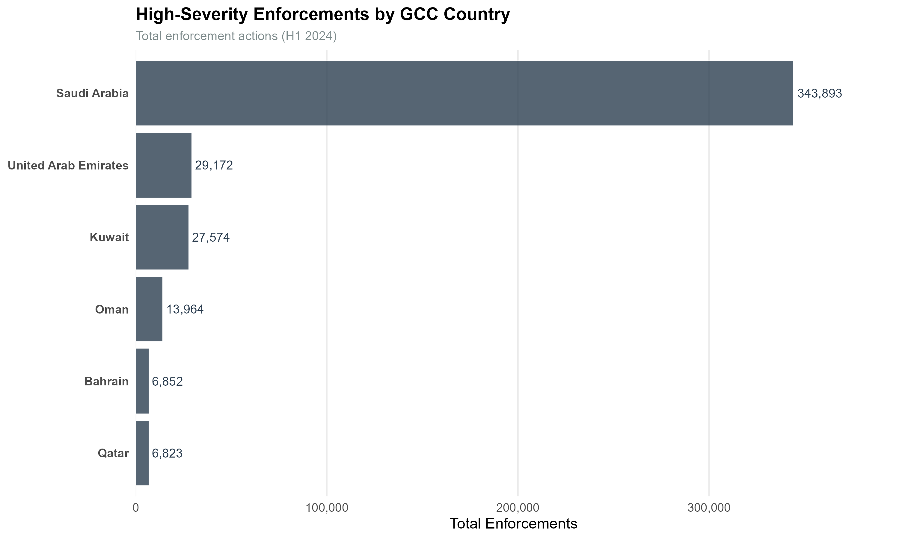
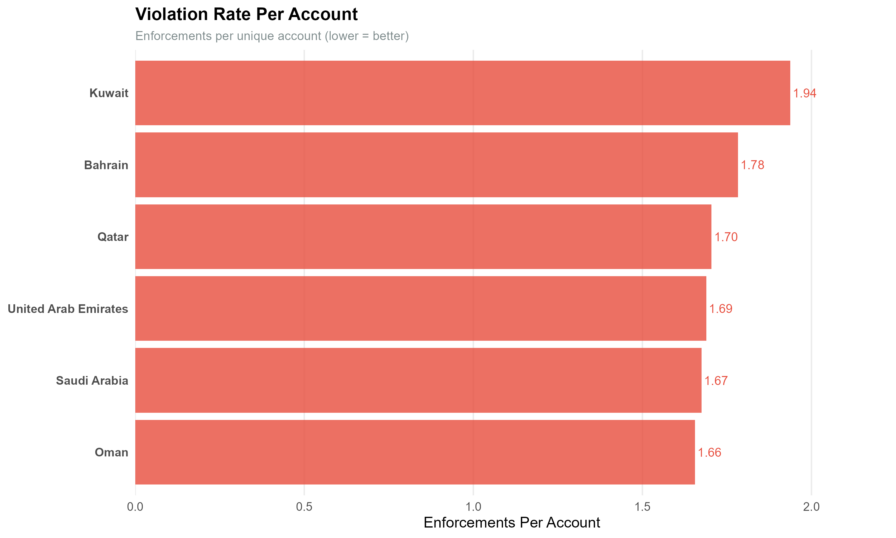
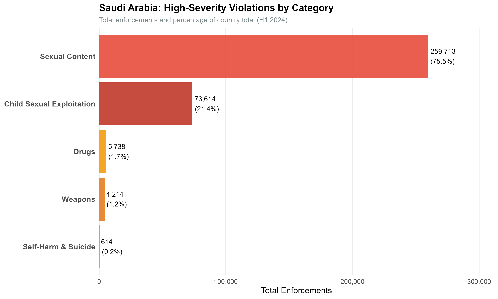
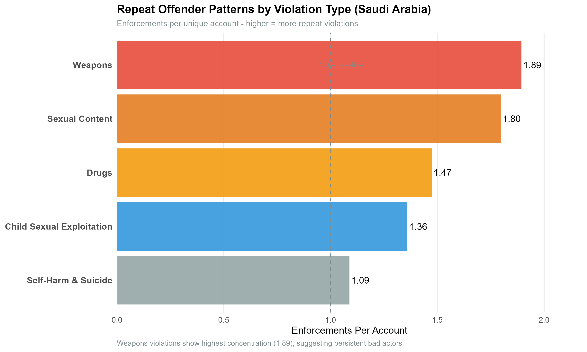
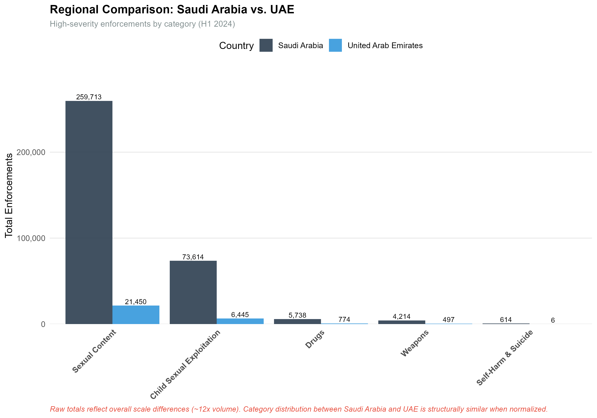
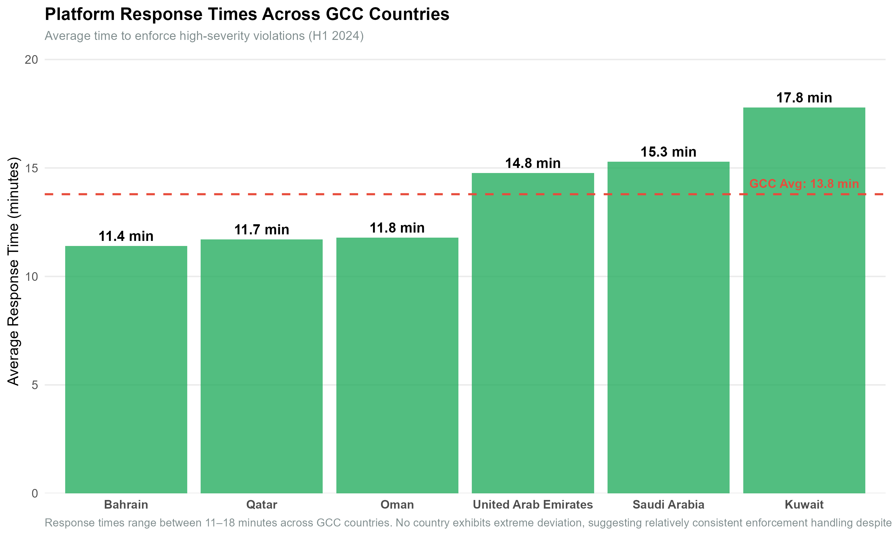

# Platform Safety Intelligence: Geographic Threat Pattern Analysis

# Table of Contents:

1. Project Overview
2. How This Project Relates To Security
3. Why Threat Analysis Matters
4. Part 1: Data Cleaning and Exploratory Analysis
5. Part 2: Exploratory Data Analysis on Gulf Cooperation Council (GCC) Countries and Threat Pattern Analysis


## Project Overview
This project analyzes data from the Snap Inc. H1 2024 Transparency Report and all findings are reproducible from the source. Full analysis code available in repository. The data is analyzed in two parts:


- 1: Data Cleaning and Exploratory Analysis
**(This portion of the exploratory data analysis was originally a project of DATA 2100 (Introduction to Data Analytics) at the University of Pennsylvania and later expanded with a security analytics framework)**
- 2: Exploratory Data Analysis on Gulf Cooperation Council (GCC) Countries and Threat Pattern Analysis

Dataset:
- **Source:** Snapchat Transparency Report (H1 2024)
- **Scale:** 22,988 enforcement records
- **Coverage:** 200+ countries, 15+ violation categories
- **Metrics:** Total enforcements, unique accounts impacted, median response times


## Skills Demonstrated In This Project

### Threat Intelligence
- Geographic threat distribution analysis
- Threat categorization and prioritization
- Pattern recognition across threat types
- Enforcement effectiveness assessment
- Repeat offender detection methodology

### Data Analytics
- Complex data reshaping (long to wide format)
- Multi-condition filtering and subsetting
- Geographic data analysis
- Statistical analysis (percentages, ratios, distributions)
- Missing data handling

### Technical Skills
- **R** (tidyr, dplyr, ggplot2)
- Data cleaning and validation
- Categorical data analysis
- Data visualization


## How This Project Relates To Security

**Content moderation IS security operations:**
- Detecting harmful content = Detecting malicious activity
- Categorizing violations = Categorizing security incidents  
- Geographic threat patterns = Understanding attack origins
- Response time metrics = Incident response performance
- Enforcement effectiveness = Security control effectiveness

ULTIMATELY protecting users FIRST and then platforms. 

## Blue Team Relevance

Blue teams protect an organizations critical assets, infrastructure, and data from threats.

**1. Threat Pattern Detection**
Identifying where threats originate and concentrate (like analyzing attack sources and geographic distribution in cybersecurity)

**2. Threat Categorization**
Classifying violations by type and severity (like categorizing security incidents: malware, phishing, DDoS, etc.)

**3. Response Time Analysis**
Measuring how quickly threats are addressed (incident response performance metrics)

**4. Geographic Intelligence**
Understanding regional threat patterns (like analyzing botnet locations or attack origins by country)

**5. Effectiveness Metrics**
Calculating enforcements per account (like measuring SOC alert-to-incident ratios or false positive rates)

**6. Repeat Offender Detection**
Identifying persistent bad actors (like tracking repeat attackers or insider threats)

### Real-World Context


Trust & Safety job postings specifically request skills in:
- Abuse pattern analysis ✓
- Data-driven investigation ✓
- Threat categorization ✓
- Geographic distribution analysis ✓


## Part 1: Data Cleaning and Exploratory Analysis

### Data Tidying (The Hard Part)
This dataset required extensive cleaning before analysis was possible:

**Challenges faced:**
- Data was in long format (22,988 rows × 7 columns)
- Values stored as character strings instead of numeric
- Multi-level categorical structure (section → category → sub_category)
- Needed to reshape for country-violation analysis
- Missing values requiring NA handling

**Data transformation process:**
```r
# Convert character values to numeric
snapchat$value <- as.numeric(snapchat$value)

# Filter to relevant enforcement data
tands <- snapchat[snapchat$section == "Overview of Our T&S Enforcements" & 
                  snapchat$category == "Country", ]

# Remove redundant columns
tands$section <- NULL
tands$category <- NULL
tands$period <- NULL

# Rename for clarity
names(tands)[names(tands) == "sub_category_1"] <- "country"
names(tands)[names(tands) == "sub_category_2"] <- "type"

# Reshape from long to wide format
tands <- spread(tands, key = metric, value = value)
```

**Result:** Transformed messy transparency report data into analysis-ready format where each row represents a unique country-violation type pairing with all metrics accessible.

**Lesson learned:** Real-world security data is rarely clean. Data wrangling skills are as important as analytical skills.


### 1. Repeat Offender Detection
**Question:** Which enforcement patterns suggest repeat offenders vs. distributed threats?

**Approach:**
Created new metric: Enforcements per unique account
- High ratio = concentrated violations (repeat offenders)
- Low ratio = distributed threats across many accounts

**Finding:**
Paraguay weapons violations: 14 enforcements from 1 unique account (14:1 ratio) - the highest enforcement-per-account ratio globally. This suggests a single repeat offender posting multiple weapons violations rather than widespread weapons content.

**Code:**
```r
tands$enforcements_per_account <- 
  tands$total_enforcements / tands$total_unique_accounts_enforced

max_row <- tands[which.max(tands$enforcements_per_account), ]
# Result: Paraguay, Weapons category, 14:1 ratio
```

**Security Implication:**
Detecting repeat offenders enables targeted account removal rather than reactive content moderation. This metric could trigger automatic escalation for accounts with ratios > 5:1, flagging potential coordinated bad actors or persistent violators.

### 2. Geographic Concentration Analysis
**Question:** What percentage of global enforcement comes from the United States of America?

**Approach:**
- Calculated total worldwide enforcements
- Isolated United States enforcement totals
- Computed percentage of global activity

**Finding:**
United States accounts for 38% of all global enforcements despite being one country among 200+ covered in the report.

**Code:**
```r
total_worldwide <- sum(tands$total_enforcements, na.rm = TRUE)
us_total <- sum(tands$total_enforcements[tands$country == "United States"], 
                na.rm = TRUE)
us_percent <- (us_total / total_worldwide) * 100
# Result: 38.09%
```

**Security Implication:**
Geographic concentration suggests either:
- Higher actual violation rates in certain regions
- More effective detection/reporting mechanisms
- Cultural/usage pattern differences

Further analysis would be needed to distinguish between these possibilities. Understanding geographic distribution helps allocate moderation resources and develop region-specific detection strategies.

### 3. Threat Category Distribution
**Question:** What types of harmful content require the most enforcement action?

**Approach:**
- Filtered dataset by violation type
- Aggregated total enforcements by category
- Analyzed category-level threat volume

**Finding:**
Weapons-related content: 234,512 total enforcements worldwide across all countries.

**Code:**
```r
weapons_rows <- tands[tands$type == "Weapons", ]
total_weapons <- sum(weapons_rows$total_enforcements, na.rm = TRUE)
# Result: 234,512
```

**Security Implication:**
Understanding threat category prevalence helps:
- Allocate detection resources to high-volume categories
- Prioritize automation efforts
- Benchmark platform safety effectiveness
- Identify emerging threat patterns

### 4. Response Effectiveness Analysis
**Question:** How quickly does the platform respond to different threat types across regions?

**Approach:**
- Analyzed median turnaround time by violation category
- Examined relationship between response time and enforcements per account
- Focused on EU countries (27 nations) for weapons-related content

**Finding:**
Response times vary significantly by threat type and geography. Created visualization showing the relationship between response speed and enforcement concentration for EU weapons violations.

**Visualization:**
```r
eu_countries <- c("Austria", "Belgium", "Bulgaria", "Croatia", "Cyprus", 
                  "Czech Republic", "Denmark", "Estonia", "Finland", "France", 
                  "Germany", "Greece", "Hungary", "Italy", "Latvia", "Lithuania", 
                  "Luxembourg", "Malta", "Netherlands", "Poland", "Portugal", 
                  "Romania", "Slovakia", "Slovenia", "Spain", "Sweden")

eu_weapons <- tands[tands$country %in% eu_countries & tands$type == "Weapons", ]

ggplot(eu_weapons, aes(x = median_turnaround_time_minutes, 
                       y = enforcements_per_account, label = country)) +
  geom_point(size = 1) +
  geom_text(vjust = -0.5, size = 2) +
  coord_flip() +
  labs(title = "EU: Enforcements per Account vs Median Turnaround Time (Weapons)",
       x = "Median Turnaround Time (minutes)",
       y = "Enforcements per Account")
```

**Security Implication:**
Response time metrics reveal operational effectiveness and help identify bottlenecks in content moderation workflows. Faster response times for high-severity violations (like child exploitation) vs. lower-severity violations (like spam) would indicate appropriate prioritization.


## Key Takeaways

### Analytical Insights
- **Repeat offenders exist:** High enforcement-per-account ratios (14:1) indicate persistent bad actors requiring different mitigation strategies
- **Threat category volumes:** 234K+ weapons violations globally shows scale of platform safety challenges
- **Pattern over volume matters:** Most interesting insights came from relative patterns (ratios, percentages) rather than absolute numbers

### Technical Lessons
- **Data cleaning is unglamorous but essential:** I spent more time reshaping data than analyzing it. This reflects real-world security work
- **Context drives interpretation:** Understanding Snapchat's user base and features improved pattern recognition
- **Metrics tell stories:** Simple calculated metrics (enforcements per account) revealed patterns invisible in raw data
- **Visualization clarifies complexity:** Geographic and categorical visualizations made 22K+ records understandable


# Part 2: Exploratory Data Analysis on Gulf Cooperation Council (GCC) Countries and Threat Pattern Analysis

## Personal Context 

Personal curiosity regarding social media applications and their threat reports was the main reason for this analysis. Snapchat is very popular amongst Gen Z. The primary demographic is around ages 13-24. Knowing this, I wanted to know how efficiently Snapchat deals with violations and potential criminal content. Is this platform safe for the younger generation?

To narrow these questions down, my focus went on the GCC, primarily because of personal cultural familiarity and similary regulatory frameworks amongst countries in the GCC. They have common cultural and legal context, and high social media penetration among youth (primary user demographic).

After narrowing down to the GCC, I chose to analyze data from specific categories which could possibly lead to heavy legal implications.

These categories are:
- Child Sexual Exploitation (CSE)
- Weapons
- Drugs
- Self-Harm & Suicide
- Sexual Content

The categories listed above are High-severity. Some of these may involve criminal conduct depending on jurisdiction.
Child exploitation, weapons trafficking, drug distribution, and terrorism 
represent the most serious threats on digital platforms. Unlike policy 
violations, these categories:
- Have criminal statutes across jurisdictions
- Require law enforcement coordination
- Cause real-world physical harm
- Are priority areas for trust & safety operations


Overall, I evaluated:
- Geographic threat distribution
- Repeat offender patterns
- Category-specific risk profiles
- Response time consistency


## Finding: 

### 1. GCC High-Severity Threat Analysis

**Observation:**
Saudi Arabia has the highest total enforcement volume by far (343k) but not the highest rate. On the other hand, Kuwait has the highest repeated offender rate with approximately 1.93 enforcements per account

**Key Metric - Repeat Offender Rate:**
- Saudi Arabia: 1.67 enforcements per account
- UAE: 1.68 enforcements per account
- Qatar: 1.70 enforcements per account
- Kuwait: 1.93 enforcements per account
- Bahrain: 1.78 enforcements per account
- Oman: 1.65 enforcements per account

**Potential Explanations:**

This pattern could reflect several factors:

1. **User Base Size:** Saudi Arabia has the largest population among GCC 
   countries (~35M vs. UAE ~10M, Qatar ~3M). If Snapchat penetration is 
   similar, higher absolute numbers are expected.

2. **Reporting Culture:** User reporting behavior may differ across countries, 
   with some markets more likely to flag violations.

3. **Usage Demographics:** If Saudi Snapchat skews younger (the primary 
   demographic for platform violations), this could explain higher volumes.

4. **Platform Prioritization:** Snapchat may allocate more moderation resources 
   to larger markets.


#### 2. Violation Category Breakdown (Saudi Arabia)
**Analysis:** Examined which high-severity categories drive enforcement numbers.

**Finding:**
Top violation categories in Saudi Arabia:
1. Sexual Content:	259713 enforcements
2. Child Sexual Exploitation:	73614	enforcements
3. Drugs:	5738 enforcements
4. Weapons:	4214 enforcements
5. Self-Harm & Suicide:	614	enforcements

**Interpretation:**
Sexual content accounts for approximately 75% (259, 713 of 343,893) of Saudi Arabia’s high-severity enforcement volume, indicating that overall totals are structurally driven by this single category rather than evenly distributed across violation types.


#### 3. Regional Comparison: Saudi Arabia vs. UAE
**Analysis:** Compared two largest GCC markets across violation categories.

**Finding:**
                            Saudi Arabia | United Arab Emirates
Child Sexual Exploitation |	73614 (21%)  | 6445	(22%)
Drugs	                    | 5738	(1.66%)| 774	(2.65%)	
Self-Harm & Suicide	      | 614	  (0.17%)| 6		(0.02%)
Sexual Content	          | 259713 (75%) | 21450 (73%)		
Weapons	                  | 4214	(1.22%)| 497	(1.70%)

**Interpretation:**
Similar patterns suggest regional norms whereas differences suggest market-specific factors. Raw enforcement totals in Saudi Arabia are approximately a magnitude higher than in the UAE across most violation categories. Overall, violation distribution patterns between Saudi Arabia and the UAE are structurally similar, suggesting comparable enforcement category composition rather than disproportionate concentration in any single category.


#### 4. Platform Response Effectiveness
**Analysis:** Measured average response times for high-severity violations by country.

**Finding:**
Average response times:
- Bahrain: 11.4 minutes
- Qatar: 11.7 minutes
- Oman: 11.7 minutes
- United Arab Emirates: 14.7 minutes
- Saudi Arabia: 15.2 minutes
- Kuwait: 17.7 minutes

**Interpretation:**
The response times are similar across all GCC countries with the average response time ranging from 11-18 minutes on average showing consistency across the region.


---

## Visualizations

### GCC Total Enforcements


### GCC Violation Rate


### Saudi Category Breakdown


### Saudi Repeat Offender Rate


### Saudi vs UAE Comparison


### GCC Response Times



# ===== INTERPRETATION SUMMARY =====

# Key Finding 1: Saudi has highest VOLUME but NOT highest RATE
# Conclusion: Population effect, not behavioral difference

# Key Finding 2: Sexual Content drives numbers (75%)
# Conclusion: This is the primary enforcement category

# Key Finding 3: Weapons show highest repeat offender rate (1.89)
# Conclusion: Concentrated threat requiring targeted removal

# Key Finding 4: Drugs/Weapons disproportionate in Saudi vs UAE
# Conclusion: Requires further investigation - not explained by population alone

# Key Finding 5: Response times consistent across GCC (11-18 min)
# Conclusion: Platform treats region equitably

**Author:** Sakina Sarfraz   


