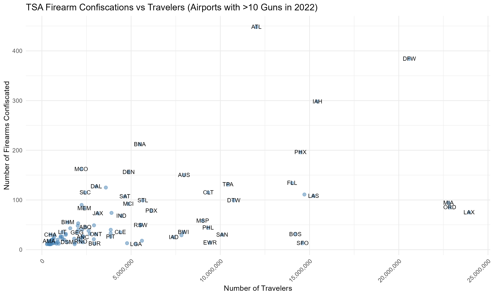

# TSA Security Anomaly Detection & Risk Assessment

## Project Overview
Analysis of 2.7 million TSA checkpoint records from 2022 to identify security anomalies, assess airport-level risk patterns, and detect temporal threat indicators. This project demonstrates data analytics skills applicable to security operations and threat intelligence.

## Dataset
- **Source:** Transportation Security Administration (TSA) checkpoint data (2022)
- **Scale:** 2,708,662 records across 365 days
- **Coverage:** All major US airports, hourly checkpoint data
- **Additional data:** Firearm confiscation records (2022)

## Key Investigations

### 1. High-Risk Airport Identification
**Question:** Which airports show disproportionately high security threat indicators?

**Approach:**
- Calculated firearm confiscation rates per 100K travelers
- Identified statistical outliers
- Analyzed risk relative to airport size

**Finding:** 
Orlando International (MCO) shows a confiscation rate of 7.3 per 100K travelers - significantly higher than comparable airports. Among airports with 10+ confiscations, MCO represents the highest relative risk.

**Security Implication:** Elevated threat profile suggests need for enhanced screening protocols or targeted security measures.

### 2. Temporal Threat Pattern Analysis
**Question:** When are security risks most concentrated?

**Approach:**
- Built function to identify peak threat windows by airport
- Analyzed hourly checkpoint volume patterns
- Correlated temporal patterns with operational needs

**Findings:**
- Newark (EWR): Highest risk at 16:00 (4 PM)
- JFK: Highest risk at 17:00 (5 PM)  
- LaGuardia (LGA): Highest risk at 09:00 (9 AM)

**Security Implication:** Resource allocation and screening intensity should prioritize these time windows.

### 3. Checkpoint-Level Risk Assessment
**Question:** How is threat exposure distributed across airport terminals?

**Approach:**
- Aggregated daily traffic by checkpoint
- Analyzed traffic concentration patterns
- Identified high-volume security bottlenecks

**Finding:**
At Philadelphia International, Checkpoint D/E processes 3x more passengers than other checkpoints, creating a concentrated security exposure point.

### 4. Threat Volume Analysis
**Question:** Which airports detected the most security threats in 2022?

**Finding:**
Hartsfield-Jackson Atlanta (ATL) confiscated 448 firearms - the highest in the nation. However, when adjusted for passenger volume, smaller airports show higher relative risk rates.

## Technical Implementation

### Data Processing
- Combined 52 weekly data files (2.7M records)
- Cleaned and validated checkpoint names across airports
- Merged checkpoint volume data with security incident data
- Handled missing values and data inconsistencies

### Analysis Techniques
- Aggregation and grouping across temporal and geographic dimensions
- Statistical risk scoring (confiscation rates per 100K)
- Outlier detection for anomaly identification
- Custom function development for reusable analysis

### Tools & Technologies
- **R** (data manipulation, statistical analysis)
- **ggplot2** (data visualization)
- **dplyr** (data transformation)
- Base R (loops, functions, aggregation)

## Skills Demonstrated

**For Security Operations:**
- Anomaly detection in large datasets (critical for SIEM log analysis)
- Risk scoring and threat assessment (prioritizing alerts)
- Temporal pattern recognition (identifying attack windows)
- Data-driven investigation (threat hunting methodology)

**For Data Analytics:**
- Large-scale data processing (2.7M records)
- Statistical analysis and outlier detection
- Data merging and integration
- Visualization for stakeholder communication

## Blue Team Relevance

This analysis demonstrates core skills used in Security Operations Centers (SOCs):

1. **Alert Triage:** Filtering 2.7M records to identify high-priority security events mirrors the process of triaging thousands of security alerts to find genuine threats.

2. **Threat Hunting:** Proactively searching for anomalies (high confiscation rates, unusual patterns) reflects the investigative mindset of threat hunters.

3. **Risk Assessment:** Calculating relative risk metrics (confiscation rates per 100K) parallels how security teams assess asset-level risk scores.

4. **Pattern Recognition:** Identifying temporal and geographic threat patterns is fundamental to detecting attack campaigns.

## Key Takeaways

- **Volume ≠ Risk:** Largest airports don't always have highest relative threat rates
- **Temporal Patterns:** Security threats concentrate at specific times requiring adaptive resource allocation  
- **Outlier Detection:** Statistical analysis reveals security anomalies not visible in aggregate data
- **Data-Driven Security:** Large-scale data analysis enables proactive rather than reactive security postures

## Future Enhancements

- Integrate weather data to assess environmental impact on security incidents
- Analyze seasonal patterns in threat detection
- Build predictive models for security resource planning
- Expand analysis to include other security incident types beyond firearms

## Code & Reproducibility

Full analysis code available in `analysis.Rmd`. All visualizations and findings are reproducible from the source data.

---

**Author:** Sakina Sarfraz 
**Contact:** sarfraz1@sas.upenn.edu  
**Institution:** University of Pennsylvania, BASc Mathematics & Data Analytics
